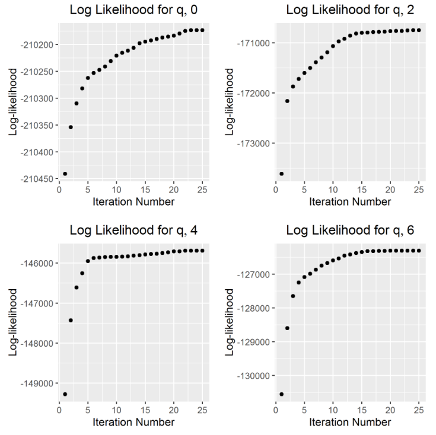
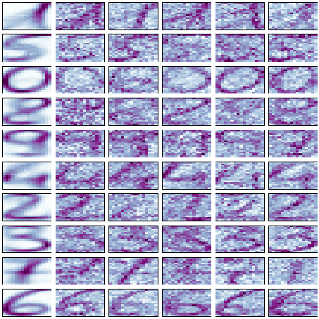
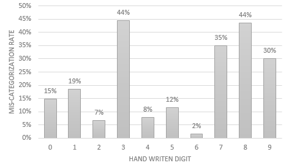

```{r setup, include=FALSE}
knitr::opts_chunk$set(echo = TRUE)
```

# Introduction

In this Homework we will cluster handwritten digits data using the EM algorithm with a principle components step within each maximization as described in the EM Algorithm for a Principle Components Gaussian Mixture Model given in the problem statement.

The handwritten digits come from the Semeion Handwritten Digit Dataset. It consists of 1593 handwritten digits written by a total of 80 individuals. These digits were scanned, and transformed into a 16x16 pixels grayscale image (for a total of 256 data points for each handwritten digits). Each pixel is the average gray value from the digit, generated by stretching the image.

First, we will do an Initialization with kmean's *R* package, then for each *q*, which represents the number of eigenvectors of the spectral decomposition of $\frac{1}{N_k} \sum\limits_{i=1}^n \gamma_{ik} (\textbf{x}_i-\hat{\textbf{u}_k})(\textbf{x}_i-\hat{\textbf{u}_k})^T$.


We will do multiple iterations (25 per *q*) of the EM step until convergence of the log-likelihood, we will choose the *q* that minimizes the AIC, then we will create visualizations of the numbers (from zero to nine) for the cluster centers with random samples and finally we will calculate the overall and per-cluster mis-categorization rate.

As mentioned, this is an EM algorithm with a principle components step within each maximization. The M step is modified in such a way that the Variance Covariance Matrix of each multivariate gaussian will depend on *q*. The resulting overall mis-categorization rate of the   implementation of the algorithm for *q=6*is a surprising **25%**.

# Initialization

We use kmeans R function with several random starts to build a preliminary HARD clustering. Kmeans was ran multiple times, with random starts, in order to minimize the possible effect of local minimal in distance measurements.

As shown in the R code at the bottom of this report, $\gamma_{ik}$ is set to 1 if observation is assigned to cluster $k$ and set to 0 otherwise. To do independent calculations, we do the initialization for each chosen *q* = 0, 2, 4 and 6.

# Convergence

For each *q* we calculated the log-likelihood on each iteration. The resulting final log-likelihoods are:

q | Last iteration Log-likelihood 
-- | ---------------------------
0 | -210,173.19
2 | -170,749.19
4 | -145,689.18
6 | -126,305.95

As we can see from the table, the log-likelihood value increases as *q* increases. To visualize the changes in a better way, we can also plot the results per iteration per *q* as shown in Figure 1.



The EM algorithm was run until the expected log-likelihood reached a level of convergence. On each iteration the log-likelihood difference with the previous iteration was calculated. If the difference was less than 1, then the iteration loop breaks. The number 1 was chosen because it made sense if we considered the log-likelihood magnitude and to get results faster.

As shown in Figure 1, for *q*=0 the log-likelihood converges at iteration 23, *q*=2 at iteration 15, *q*=4 at iteration 5 and *q*=6 at iteration 16. One would think that the convergence would be related to *q* but it seems that *q*=4 has the fastest convergence, not *q*=6.

# Choice of Number of Principle Components

The *q* which minimizes the AIC is 6. The AIC that we get on each iteration is:

q | AIC
-- | --------
0 | 420,348.4
2 | 342,522.4
4 | 293,416.4
6 | 255,655.9

The Akaike information criterion (AIC) is a measure of the relative quality of a statistical model for a given set of data. A lower AIC value means less information is lost given the specific model.

# Visualization of Clusters

For *q=6* we plot the results. In the first column of Figure 2 we can see the cluster means and in each of the columns 2 through 6 we plot a random draw from the cluster.

We can clearly see that the clusters centers show the numbers: 1, 5, 0, 8, 9, 4, 2, 3, 7 and 6. So all numbers from 0 to 9. A special palette from the RColorBrewer package was used to visualize the numbers. 

```{r, eval=FALSE, echo=TRUE}
colorRampPalette(brewer.pal(9,"BuPu"))(100)
```

This palette improved the visualization because in a black and white palette the number zero is repeated or lost with similar digits such as 6. We can conclude that the quality of the clustering is good.



# Accuracy Assessment

EM gives probability that a point is in a cluster (in the $\gamma$ matrix which includes the posterior probabilities), and so the cluster with the highest probability at convergence will be taken as the final cluster for a given digit.

Accuracy was measured by calculating misclassification rate (define an observation as mis-categorized if it is not in the most common categorization for the particular class).

The missclassification per digit is shown in Figure 3. We can see that the numbers 3 and 8, which are very similar, have very high miss classification rate, as well as number 7 which is similar to 1. The number 6 for example is categorized almost perfectly. For *q=6* the overall mis-categorization rate of our algorithm is **25%**.




